# UrbanNexus — Residence Amenity & Technician Management System (Frontend)

> A React + Vite web application for managing residential amenities, technician assignments, payments, and administrative operations for a gated community or housing complex.

---

## Table of Contents

1. [Project Overview](#project-overview)
2. [Tech Stack](#tech-stack)
3. [Project Structure](#project-structure)
4. [Setup & Installation](#setup--installation)
5. [How to Run](#how-to-run)
6. [Components & Features](#components--features)
7. [Role-Based Access](#role-based-access)
8. [API Integration](#api-integration)
9. [Environment Variables](#environment-variables)
10. [Screenshots](#screenshots)
11. [Known Limitations](#known-limitations)
12. [References & URLs](#references--urls)

---

## Project Overview

**UrbanNexus** is the frontend interface for a Residence Amenity & Technician Management System. It is a role-based React application where three types of users — **SuperAdmin**, **Resident**, and **Technician** — each see a tailored dashboard upon login.

The system allows residents to book amenities (e.g. gym, pool), request technical services (plumber, electrician, etc.), view dues, and manage their profile. Admins can manage the resident and technician directories, oversee facilities, monitor financial transactions, run overdue payment scans, and review a tamper-evident audit log. Technicians can view and resolve their assigned tasks.

Authentication is handled via **JWT tokens**, decoded on the frontend using `jwt-decode` to determine the user's role and identity.

---


## Tech Stack

| Layer | Technology                    |
|-------|-------------------------------|
| Framework | React 19                      |
| Build Tool | Vite                          |
| Routing | React Router DOM              |
| HTTP Client | Axios (via `src/api.js`)      |
| Auth | JWT (`jwt-decode`)            |
| Icons | Lucide React                  |
| Styling | Tailwind CSS                  |
| Backend | Node.js + Express (`/backend`) |
| Database | MySQL                         |
| Dev Environment | WebStorm             |

---

## Project Structure

```
urban_nexus/
│
├── backend/                        # Node.js + Express backend
│   ├── adminCreate.js              # Script to seed SuperAdmin
│   ├── authMiddleware.js           # JWT verification middleware
│   ├── db.js                       # MySQL database connection
│   ├── server.js                   # Main Express server & all API routes
│   ├── reset_db.js                 # DB reset utility
│   ├── .env                        # Backend environment variables
│   └── package.json
│
├── frontend/                       # React + Vite frontend
│   ├── public/
│   │   └── index.html
│   ├── src/
│   │   ├── assets/                 # Static assets (images, screenshots)
│   │   ├── components/             # All React page components
│   │   │   ├── AdminDashboard.jsx      # Admin control center with tabbed navigation
│   │   │   ├── AmenityDirectory.jsx    # Facility listing & add amenity (Admin)
│   │   │   ├── AuditLog.jsx            # Tamper-evident DB trigger audit log
│   │   │   ├── BookAmenity.jsx         # Amenity booking form (Resident)
│   │   │   ├── BookTechnician.jsx      # Technician request form (Resident)
│   │   │   ├── Dashboard.jsx           # Role-based router component
│   │   │   ├── FinancialManager.jsx    # Transaction ledger & payment processing
│   │   │   ├── Login.jsx               # Login page with JWT auth
│   │   │   ├── ResidentDashboard.jsx   # Resident portal with 5 sub-views
│   │   │   ├── ResidentDirectory.jsx   # Resident CRUD management (Admin)
│   │   │   ├── TechnicianDashboard.jsx # Task sheet for technicians
│   │   │   └── TechnicianDirectory.jsx # Technician CRUD management (Admin)
│   │   ├── api.js                  # Axios instance with base URL config
│   │   ├── App.jsx                 # Root component with React Router routes
│   │   ├── main.jsx                # React entry point
│   │   └── index.css               # Global Tailwind CSS imports
│   ├── .gitignore
│   ├── eslint.config.js
│   ├── index.html
│   ├── package.json
│   ├── package-lock.json
│   ├── vite.config.js
│   └── README.md                   # This file
│
├── resources/                      # Additional project resources
├── .env_example                    # Example environment variable template
└── .gitignore
```

---

## Setup & Installation

### Prerequisites

- [ ] Node.js (v18 or above) installed
- [ ] npm installed
- [ ] MySQL Server running
- [ ] Backend server set up and running (see backend setup below)

---

### Frontend Setup

1. Navigate to the frontend folder:
   ```bash
   cd frontend
   ```

2. Install frontend dependencies:
   ```bash
   npm install
   ```

---

## How to Run

```bash
cd frontend
npm run dev
```

The app will launch at:
```
http://localhost:5173
```

To build for production:
```bash
npm run build
```

### Default Login Credentials

| Role | Username | Password |
|------|----------|----------|
| SuperAdmin | `admin` | *(set via `adminCreate.js`)* |
| Resident | *(added by admin)* | *(set during registration)* |
| Technician | *(added by admin)* | *(set during registration)* |

---

## Components & Features

### `Login.jsx`
- Username/password login form
- Toggleable password visibility
- On success, stores JWT in `localStorage` and redirects to `/dashboard`
- Displays error messages on failed login

### `Dashboard.jsx`
- Decodes JWT from `localStorage` using `jwt-decode`
- Routes to `AdminDashboard`, `ResidentDashboard`, or `TechnicianDashboard` based on `role` in token
- Displays global navbar with role badge and logout button
- Redirects unauthenticated users to `/login`

### `AdminDashboard.jsx`
- Tabbed layout: **Residents | Technical Staff | Facilities | Financials**
- Renders `ResidentDirectory`, `TechnicianDirectory`, `AmenityDirectory`, or `FinancialManager` per active tab
- Persistent `AuditLog` sidebar on all tabs

### `ResidentDirectory.jsx`
- Search residents by name (live search via API)
- Add new resident via modal form (name, block, floor, unit, contact, ownership status, members)
- Delete resident with confirmation dialog

### `TechnicianDirectory.jsx`
- List all technicians with skill badges
- Add technician via modal (ID, name, contact, skill: Plumber / Electrician / Maintenance / Carpenter)

### `AmenityDirectory.jsx`
- List all registered facilities with capacity badges
- Add new amenity via modal (numeric ID, name, max capacity)

### `FinancialManager.jsx`
- Search transactions by resident name
- Display transaction status (Paid / Unpaid) with colour-coded badges
- Process individual payments via "Process Pay" button
- Run overdue cursor scan (triggers a backend stored procedure/cursor)

### `AuditLog.jsx`
- Displays tamper-evident log of all DB trigger-recorded actions
- Shows: action type, table affected, record ID, details, and timestamp
- Auto-fetched on component mount; scrollable list

### `ResidentDashboard.jsx`
- 5-card menu: **My Dues | Facilities | Technical Staff | My Bookings | Settings**
- **My Dues**: Fetches pending invoices; resident can pay inline
- **Facilities**: Navigates to `BookAmenity`
- **Technical Staff**: Navigates to `BookTechnician`
- **My Bookings**: Shows history of amenity reservations and technician assignments with status badges
- **Settings**: Fetch and update profile (name, contact, password)

### `BookAmenity.jsx`
- Dynamically loads facility list from API
- Form: facility selector, date, time slot (1–10), guest count
- Real-time capacity validation with warning/block UI
- On success: displays booking invoice (booking ID, amenity name, date/slot, total with GST, transaction number)

### `BookTechnician.jsx`
- Form: skill selector, date, time slot (1–4)
- Auto-assigns an available technician from the backend
- On success: displays dispatch invoice (assignment ID, technician name, date/slot, base price, transaction number)

### `TechnicianDashboard.jsx`
- Lists all assigned tasks with resident name, unit, and slot
- "Mark Resolved" button to update task status
- Resolved tasks display a green checkmark badge

---

## Role-Based Access

| Feature | SuperAdmin | Resident | Technician |
|---------|-----------|----------|------------|
| Resident Directory (CRUD) | ✅ | ❌ | ❌ |
| Technician Directory (CRUD) | ✅ | ❌ | ❌ |
| Amenity Directory (CRUD) | ✅ | ❌ | ❌ |
| Financial Ledger & Payments | ✅ | ❌ | ❌ |
| Audit Log | ✅ | ❌ | ❌ |
| Book Amenity | ❌ | ✅ | ❌ |
| Request Technician | ❌ | ✅ | ❌ |
| View & Pay Dues | ❌ | ✅ | ❌ |
| Booking History | ❌ | ✅ | ❌ |
| Profile Settings | ❌ | ✅ | ❌ |
| View & Resolve Tasks | ❌ | ❌ | ✅ |

---

## API Integration

All HTTP requests are made through a shared Axios instance defined in `src/api.js`, which reads the base URL from the Vite environment variable `VITE_API_BASE_URL`.

Key API endpoints consumed by the frontend:

| Endpoint | Method | Used In | Description |
|----------|--------|---------|-------------|
| `/login` | POST | `Login.jsx` | Authenticate user, receive JWT |
| `/amenities` | GET | `AmenityDirectory`, `BookAmenity` | Fetch all amenities |
| `/amenities` | POST | `AmenityDirectory` | Add new amenity |
| `/admin/residents/search` | GET | `ResidentDirectory` | Search residents by name |
| `/residents` | POST | `ResidentDirectory` | Add new resident |
| `/residents/:id` | DELETE | `ResidentDirectory` | Delete resident |
| `/admin/technicians` | GET | `TechnicianDirectory` | List all technicians |
| `/technicians` | POST | `TechnicianDirectory` | Add new technician |
| `/admin/transactions` | GET | `FinancialManager` | Get transactions (filterable) |
| `/admin/process-overdue` | POST | `FinancialManager` | Run overdue cursor scan |
| `/payments/:transNo/pay` | POST | `FinancialManager`, `ResidentDashboard` | Process a payment |
| `/admin/audit-logs` | GET | `AuditLog` | Fetch audit log entries |
| `/bookings/amenity` | POST | `BookAmenity` | Create amenity booking |
| `/bookings/technician` | POST | `BookTechnician` | Request & assign technician |
| `/residents/me/dues` | GET | `ResidentDashboard` | Get resident's pending dues |
| `/residents/me/bookings` | GET | `ResidentDashboard` | Get resident's booking history |
| `/profile/me` | GET | `ResidentDashboard` | Fetch resident profile |
| `/profile/update` | PUT | `ResidentDashboard` | Update resident profile |
| `/technician/me/tasks` | GET | `TechnicianDashboard` | Get technician's task list |
| `/technician/tasks/:id/status` | PUT | `TechnicianDashboard` | Update task status |

---

## Environment Variables

**Frontend** (`frontend/.env`):
```env
VITE_API_BASE_URL=http://localhost:5000
```

**Backend** (`backend/.env`):
```env
DB_HOST=localhost
DB_USER=root
DB_PASSWORD=your_password
DB_NAME=urban_nexus
JWT_SECRET=your_secret
PORT=5000
```

> A template is available at `/.env_example` in the project root.

---

## Screenshots

| Page                                                         | Description |
|--------------------------------------------------------------|-------------|
| 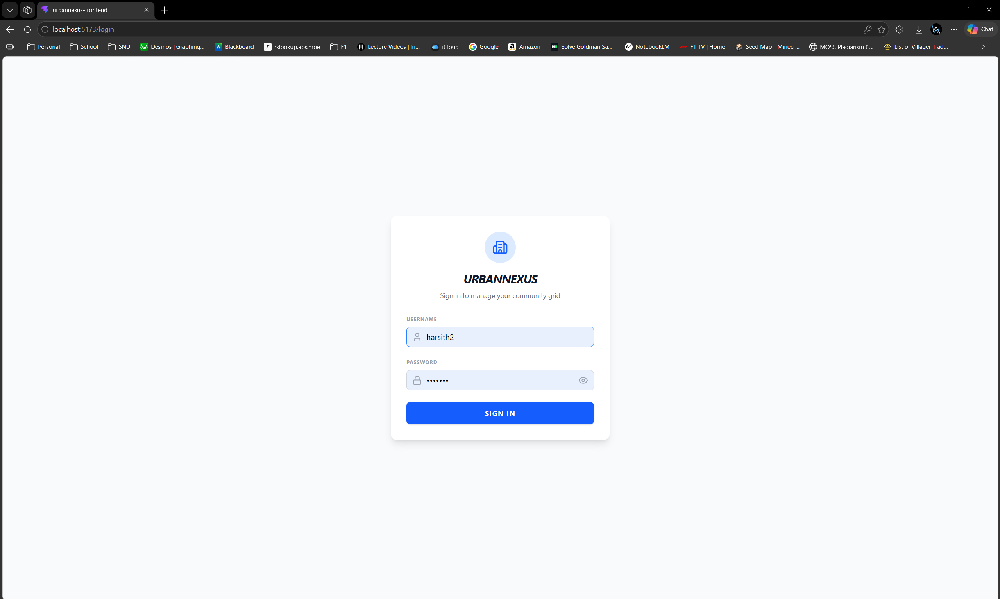                               | Login screen — JWT-based auth |
| 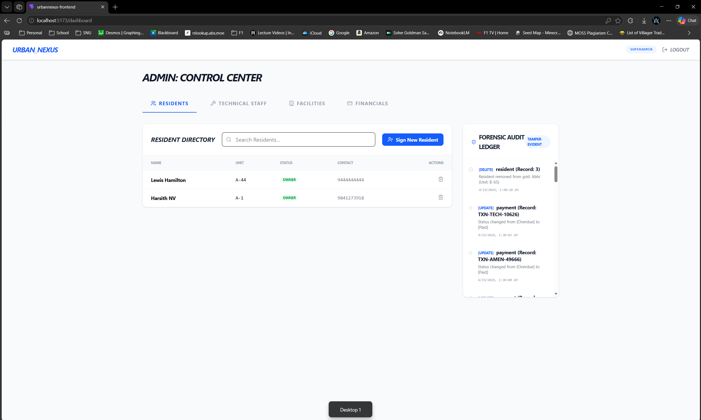           | Admin control center with tab nav |
| 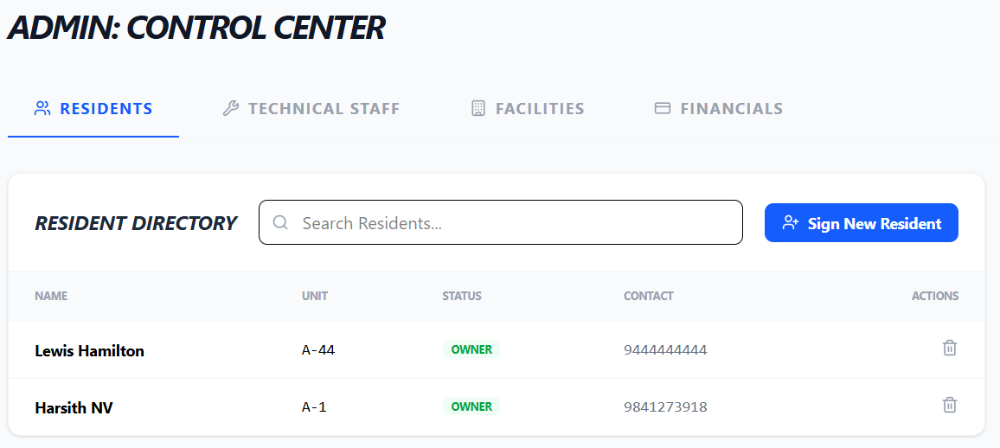     | Resident CRUD with search |
| 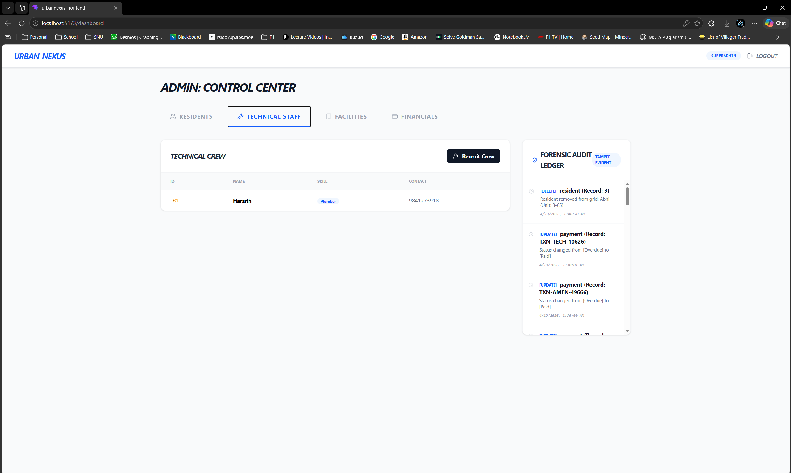 | Technician listing and add modal |
| 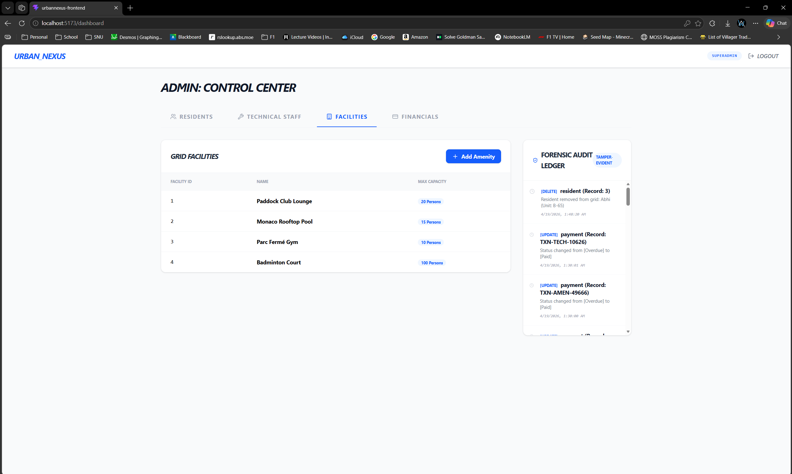       | Facility management |
| 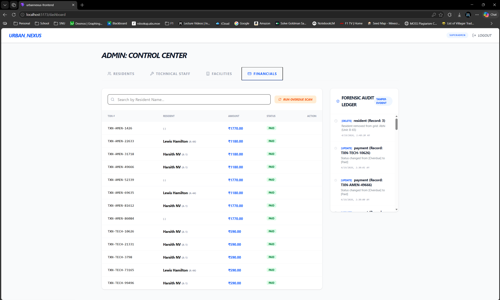       | Transaction ledger and payment processing |
| 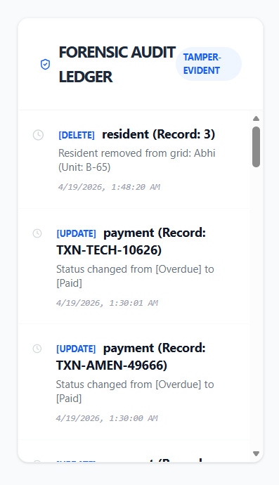                       | DB-trigger audit trail |
| 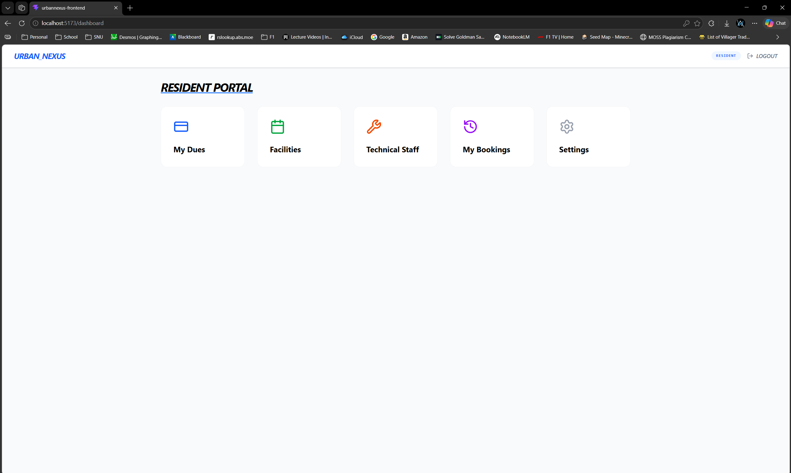           | Resident 5-card menu |
| 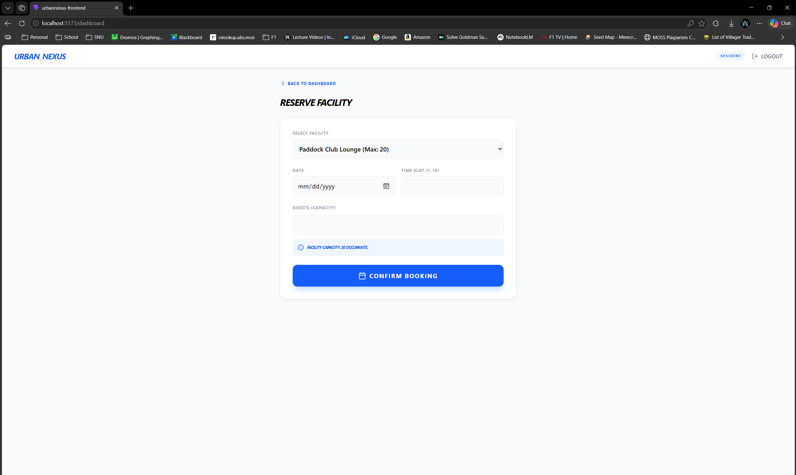                 | Facility booking with capacity check |
| 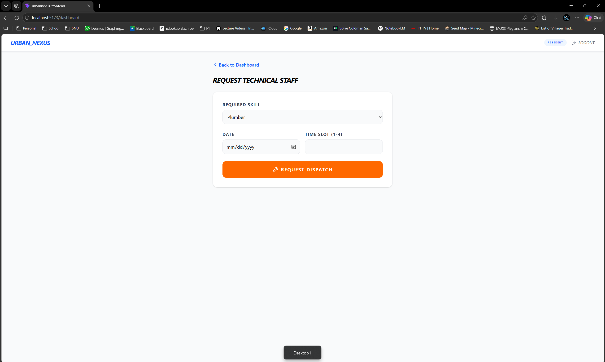           | Technician dispatch form |
| 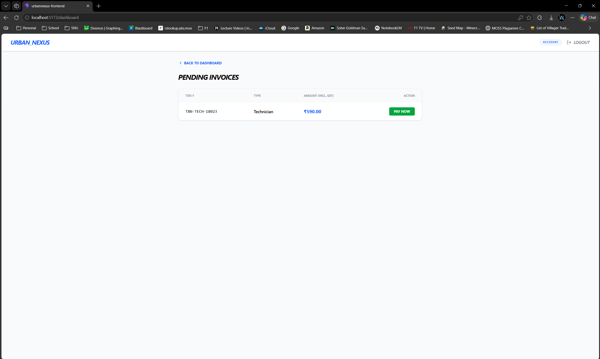 | Resident pending dues and inline payment |
| 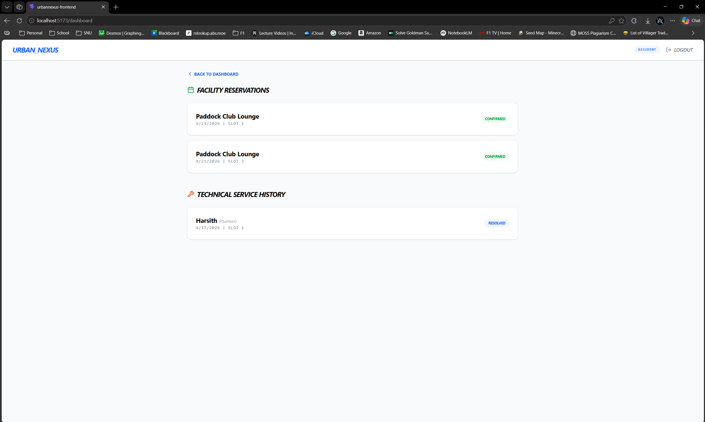 | Amenity and technician booking history |
| 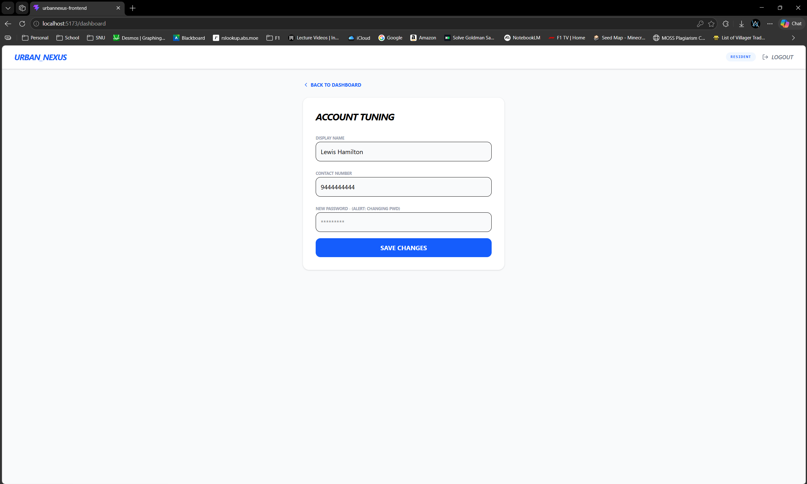 | Resident profile settings and update form |
| 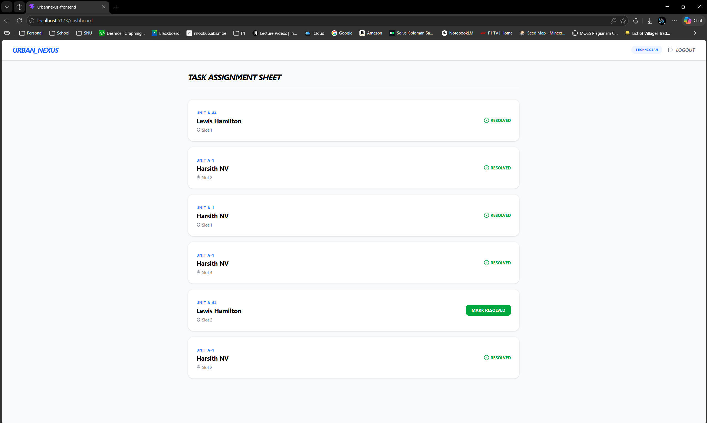 | Task sheet with resolve action |

---

## Known Limitations

- [ ] JWT is stored in `localStorage` — vulnerable to people with source access
- [ ] No real-time updates — data must be refreshed manually after changes
- [ ] Password is shown in plain text in the Settings form field (no masking on input)
- [ ] No pagination on directory tables — all records are loaded at once
- [ ] Technician is auto-assigned by the backend; residents cannot choose a specific technician
- [ ] No mobile-responsive layout — optimised for desktop/laptop screens
- [ ] No form validation feedback beyond `alert()` on error

---

## References & URLs

### Frameworks & Libraries

| # | Resource | URL |
|---|----------|-----|
| 1 | React Official Docs | https://react.dev/ |
| 2 | Vite Documentation | https://vitejs.dev/guide/ |
| 3 | React Router DOM | https://reactrouter.com/en/main |
| 4 | Axios HTTP Client | https://axios-http.com/docs/intro |
| 5 | jwt-decode | https://github.com/auth0/jwt-decode |
| 6 | Lucide React Icons | https://lucide.dev/guide/packages/lucide-react |
| 7 | Tailwind CSS Docs | https://tailwindcss.com/docs/ |

### Backend & Database

| # | Resource | URL |
|---|----------|-----|
| 8 | Node.js Docs | https://nodejs.org/en/docs |
| 9 | Express.js Docs | https://expressjs.com/ |
| 10 | MySQL Official Documentation | https://dev.mysql.com/doc/ |
| 11 | W3Schools SQL Tutorial | https://www.w3schools.com/sql/ |
| 12 | JSON Web Tokens (JWT) | https://jwt.io/introduction |

### Tools

| # | Resource | URL |
|---|----------|-----|
| 13 | WebStorm IDE | https://www.jetbrains.com/webstorm/ |
| 14 | Postman API Testing | https://www.postman.com/ |
| 15 | MySQL Workbench | https://www.mysql.com/products/workbench/ |

### Code References

| # | Description | Source / URL |
|---|-------------|--------------|
| 1 | [e.g., JWT auth pattern in React] | [URL or "Self-written"] |
| 2 | [e.g., Axios instance setup] | [URL or "Self-written"] |
| 3 | [Add any Stack Overflow / tutorials referenced] | [URL] |
 
---